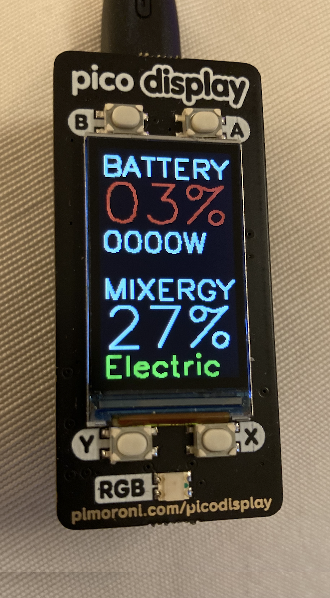

# combinedChargeLvlsPicoDisplay

Combined status display for Mixergy and GivEnergy APIs for Pimoroni Pico Display attached to Pico W board

Requires a secrets.py file with WLAN SSID, Password, GivEnergy invertor ID, GivEnergy authorization token, and Mixergy equivalents (see template in repo)
With thanks to Tomas McGuinness for the inspiration https://github.com/tomasmcguinness/homeassistant-mixergy in his mixergy.py file

